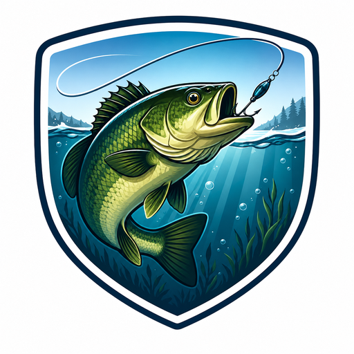

# Fishing Tracker – Home Assistant Integration

**Version 2.9.0** | Custom Integration für Home Assistant

Eine intelligente Angelassistent-Integration mit 22-Faktor-Beißchancen-Prognose, Live-Wetterdaten, Solunar-Theorie, Pegelstand und Fangbuch.

---

## Features

### Prognose-Engine (22 Faktoren)
| Faktor | Quelle |
|---|---|
| Lufttemperatur, Luftdruck, Wind, Bewölkung, Regen, UV | Open-Meteo (Live) |
| Wassertemperatur | wassertemperatur.site (Live) |
| Sauerstoffgehalt O₂ | Berechnet aus Wassertemp. |
| Solunar Mondtransit-Uhrzeiten | Astronomieberechnung (kein API) |
| Mondphase (artspezifisch) | HA moon_phase Entity |
| Laichzeiten (10 Fischarten) | Interner Kalender |
| Pegelstand + Wassertrübung | PEGELONLINE WSV (Live) |
| Saisonal-Tageszeit je Fischart | Praxiswissen-Datenbank |
| Herbst-Fresswelle | Oktober/November Bonus |
| Temperaturwechsel-Geschwindigkeit | Δ Wassertemp/Tag |
| Lichtintensitätswechsel | Bewölkungsänderung |
| Wetterfront-Erkennung | Druck + Wind + Wolken |
| Windrichtung | Süd/West günstig |
| Fanghistorie (lernend) | Eigene Fangdaten |

### Sensoren (22 Stück)
- Beißchance, Beste Zeit, Tages-/Wochenprognose
- Fishing Intelligence (Smart Score + Gründe)
- Wassertemperatur (Gewässer), Solunar Beißzeiten, Laichzeiten
- Pegelstand (cm + Trend), Köderempfehlung (Wettermethode)
- Fischarten-Ranking, Online Wetterstatus, Advanced Intelligence
- Statistiken, Empfehlung, Fanghistorie, Spots, Köder, Zeiten, Letzter Fang

### Fangbuch
- Services: `log_catch`, `log_no_catch`
- Import/Export CSV und JSON
- GPS-Koordinaten, Spot, Köder, Länge, Notizen

### Dashboard
- Native Lovelace Custom Card `custom:fishing-tracker-card`
- 9 Views: Übersicht, Prognosen, Zielfische, Spots, Fangbuch, Statistiken, Köder, Wetter, Einstellungen
- Schnellaktionen (Fang/Kein Fang direkt aus dem Dashboard)
- Auto-Dashboard unter `/local/fishing_tracker_dashboard.html`

---

## Installation

### Manuelle Installation
1. Ordner `custom_components/fishing_tracker` nach `/config/custom_components/` kopieren
2. Ordner `www/` Inhalt nach `/config/www/` kopieren
3. Home Assistant neu starten
4. Einstellungen → Integrationen → **Fishing Tracker** hinzufügen

### HACS
In HACS als Custom Repository hinzufügen:
- URL: `https://github.com/Simforyou/Fishing-Tracker`
- Kategorie: Integration

### Lovelace Custom Card
In `configuration.yaml` oder Lovelace Resources:
```yaml
resources:
  - url: /local/fishing-tracker-card.js?v=290
    type: module
```

Card-Konfiguration:
```yaml
type: custom:fishing-tracker-card
title: Fishing Tracker
default_view: overview
show_sidebar: true
```

---

## Konfiguration

### Pflichtfelder
| Feld | Beschreibung |
|---|---|
| Name | Name der Integration |
| Weather Entity | z.B. `weather.home` |

### Optionale Felder
| Feld | Beschreibung | Beispiel |
|---|---|---|
| Person Entity | GPS-Position des Anglers | `person.max` |
| Moon Entity | Mondphasen-Sensor | `sensor.moon_phase` |
| Online Wetter | Open-Meteo aktivieren | `true` |
| Wassertemperatur URL | wassertemperatur.site URL | `https://wassertemperatur.site/flusse/water-temp-in-dinkel` |
| Angelplatz Latitude | Für Solunar-Berechnung | `52.211` |
| Angelplatz Longitude | Für Solunar-Berechnung | `7.022` |
| Pegelstation UUID | PEGELONLINE UUID | `abc123...` |
| Pegelstation Name | Anzeigename | `Gronau/Dinkel` |

### Pegelstation finden
```
https://pegelonline.wsv.de/webservices/rest-api/v2/stations.json
```
Nach Gewässer suchen, UUID kopieren und in den Options eintragen.

### Gewässer-Wassertemperatur
Auf [wassertemperatur.site](https://wassertemperatur.site) dein Gewässer suchen:
- Flüsse: `/flusse/water-temp-in-[NAME]`
- Seen: `/seen/water-temp-in-[NAME]`

---

## Services

| Service | Beschreibung | Parameter |
|---|---|---|
| `fishing_tracker.log_catch` | Fang speichern | fish_type, spot, bait, length_cm, notes |
| `fishing_tracker.log_no_catch` | Kein Fang speichern | fish_type, spot, bait, notes |
| `fishing_tracker.export_csv` | Fangdaten als CSV | path |
| `fishing_tracker.export_json` | Fangdaten als JSON | path |
| `fishing_tracker.import_csv` | CSV importieren | path |
| `fishing_tracker.install_dashboard` | Dashboard neu installieren | – |

---

## Wettermethode (Köderfarbe)

Die Köderempfehlung basiert auf der Wettermethode (Lieblingsköder):

| Wasser | Licht | Empfehlung |
|---|---|---|
| Klar | Sonne | Naturfarben (Sunny, Whisky) |
| Klar | Wolken | Naturfarben / dezente Kontraste |
| Leicht trüb | Sonne | Kontraste / Firetiger ⭐ optimal |
| Leicht trüb | Wolken | Kontraste (Firetiger, Pinky) |
| Trüb | – | Schockfarben (Pinky, Mr. White) |
| Sehr trüb | – | UV-aktiv (Sheriff, Neo) |

---

## Projektstruktur

```
custom_components/fishing_tracker/
├── __init__.py              # Setup, Services
├── analytics.py             # Beißprognose-Berechnungen
├── advanced_intelligence.py # Lernende KI-Engine
├── bait_advisor.py          # Köderempfehlung, Wettermethode  ← NEU 2.9
├── button.py                # HA Button-Entities
├── config_flow.py           # Konfigurationsdialog
├── const.py                 # Konstanten
├── fish_profiles.py         # 10 Fischarten-Profile
├── fishing_knowledge.py     # Köder-/Ruten-Wissen
├── frontend.py              # www-Installer
├── intelligence.py          # Smart Score Engine (22 Faktoren)
├── manifest.json            # HA Integration Manifest
├── ml.py                    # ML-Grundlage
├── number.py                # HA Number-Entities
├── select.py                # HA Select-Entities
├── sensor.py                # 22 Sensoren
├── solunar.py               # Solunar Astronomie            ← NEU 2.8
├── spawning.py              # Laichzeiten-Kalender          ← NEU 2.8
├── species_ranking.py       # Fischarten-Ranking
├── storage.py               # JSON-Datenspeicher
├── water_level.py           # PEGELONLINE Wasserstand       ← NEU 2.9
├── water_temperature.py     # Wassertemperatur-Scraper      ← NEU 2.8
└── weather_engine.py        # Open-Meteo Engine
www/
├── fishing-tracker-card.js       # Lovelace Custom Card
├── fishing_tracker_dashboard.html # Auto-Dashboard
├── fishing_tracker_map.html       # Heatmap & Spots
├── fishing_tracker_log.html       # Fanghistorie
└── fishing_tracker_icon.png
```

---

## Lizenz

Dieses Projekt steht unter der MIT-Lizenz.

## Links
- [GitHub](https://github.com/Simforyou/Fishing-Tracker)
- [Issues](https://github.com/Simforyou/Fishing-Tracker/issues)
- [PEGELONLINE](https://pegelonline.wsv.de)
- [wassertemperatur.site](https://wassertemperatur.site)
- [Open-Meteo](https://open-meteo.com)
